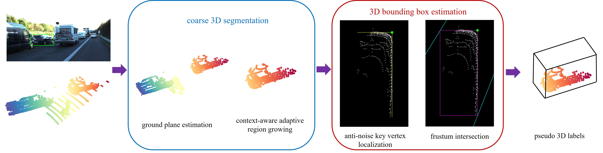

FGR
===
This repository contains the python implementation for paper "FGR: Frustum-Aware Geometric Reasoning for Weakly Supervised 3D Vehicle Detection"(ICRA 2021)\[[arXiv](https://arxiv.org/abs/2105.07647)\]



## Installation

### Prerequisites
- Python 3.6
- scikit-learn, opencv-python, numpy, easydict, pyyaml

```shell
conda create -n FGR python=3.6
conda activate FGR
pip install -r requirements.txt
```

## Usage
### Data Preparation

Please download the KITTI 3D object detection dataset from [here](http://www.cvlibs.net/datasets/kitti/eval_object.php?obj_benchmark=3d) and organize them as follows:

```text
${Root Path To Your KITTI Dataset}
├── data_object_image_2
│   ├── training
│   │   └── image_2
│   └── testing (optional)
│       └── image_2
│
├── data_object_label_2
│   └── training
│       └── label_2
│
├── data_object_calib
│   ├── training
│   │   └── calib
│   └── testing (optional)
│       └── calib
│
└── data_object_velodyne
    ├── training
    │   └── velodyne
    └── testing (optional)
        └── velodyne
```

### Retrieving psuedo labels
#### Stage I: Coarse 3D Segmentation
In this stage, we get coarse 3D segmentation mask for each car. Please run the following command:

```shell
cd FGR
python save_region_grow_result.py --kitti_dataset_dir ${Path To Your KITTI Dataset} --output_dir ${Path To Save Region-Growth Result}
```

- This Python file uses multiprocessing.Pool, which requires the number of parallel processes to execute. Default process is 8, so change this number by adding extra parameter "--process ${Process Number You Want}" in above command if needed. 
- The space of region-growth result takes about **170M**, and the execution time is about **3** hours when using process=8 (default)

#### Stage II: 3D Bounding Box Estimation
In this stage, psuedo labels with KITTI format will be calculated and stored. Please run the following command:

```shell
cd FGR
python detect.py --kitti_dataset_dir ${Path To Your KITTI Dataset} --final_save_dir ${Path To Save Psuedo Labels} --pickle_save_path ${Path To Save Region-Growth Result}
```

- The multiprocessing.Pool is also used, with default process **16**. Change it by adding extra parameter "--process ${Process Number}" in above command if needed. 
- Add "--not_merge_valid_labels" to ignore validation labels. We only create psuedo labels in training dataset, for further testing deep models, we simply copy groundtruth validation labels to saved path. If you just want to preserve training psuedo, please add this parameter
- Add "--save_det_image" if you want to visualize the estimated bbox (BEV). The visualization results will be saved in "final_save_dir/image".
- One visualization sample is drawn in different colors: 
    - **white**  points indicate the coarse 3D segmentation of the car 
    - **cyan**   lines indicate left/right side of frustum
    - **green**  point indicates the **key vertex**
    - **yellow** lines indicate GT bbox's 2D projection
    - **purple** box indicates initial estimated bounding box
    - **red**    box indicates the intersection based on purple box, which is also the 2D projection of final estimated 3D bbox


We also provide final pusedo training labels and GT validation labels in ./FGR/detection_result.zip. You can directly use them to train the model.


### Use psuedo labels to train 3D detectors
#### 1. Getting Startted

Please refer to the OpenPCDet repo [here](https://github.com/open-mmlab/OpenPCDet) and complete all the required installation.

After downloading the repo and completing all the installation, a small modification of original code is needed：

```text
--------------------------------------------------
pcdet.datasets.kitti.kitti_dataset:
1. line between 142 and 143, add: "if len(obj_list) == 0: return None"
2. line after 191, delete "return list(infos)", and add:

final_result = list(infos)
while None in final_result:
    final_result.remove(None)
            
return final_result
--------------------------------------------------
```

This is because when creating dataset, OpenPCDet (the repo) requires each label file to have at least one valid label. In our psuedo labels, however, some bad labels will be removed and the label file may be empty.

#### 2. Data Preparation

In this repo, the KITTI dataset storage is as follows:

```text
data/kitti
├── testing
│   ├── calib
│   ├── image_2
│   └── velodyne
└── training
    ├── calib
    ├── image_2
    ├── label_2
    └── velodyne
```

It's different from our dataset storage, so we provide a script to construct this structure based on **symlink**:

```shell
sh create_kitti_dataset_new_format.sh ${Path To KITTI Dataset} ${Path To OpenPCDet Directory}
```

#### 3. Start training

Please remove the symlink of 'training/label_2' temporarily, and add a new symlink to psuedo label path. Then follow the OpenPCDet instructions and train PointRCNN models. 

## Citation 
If you find our work useful in your research, please consider citing:
```
@inproceedings{wei2021fgr,
  title={{FGR: Frustum-Aware Geometric Reasoning for Weakly Supervised 3D Vehicle Detection}},
  author={Wei, Yi and Su, Shang and Lu, Jiwen and Zhou, Jie},
  booktitle={ICRA},
  year={2021}
}
```
